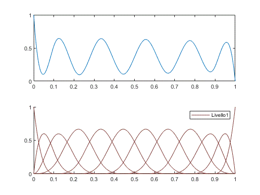

# adAHBsplineFEM

Adaptive hierarchical B-spline solution for steady advection-diffusion problem.

This MATLAB library contains implementations of adaptive FEM with hierarchical B-spline basis functions for the numerical solution of the one-dimensiona, steady-state advection-diffusion equation that I developed as a final project for the couse of Matematica Numerica at University of Parma. 

The theoretical explaination is contained in the paper [Hierarchical B-splines for the adaptive solution of one-dimensional advection-diffusion problems](Hierarchical_Bsplines_ad_problems.pdf).